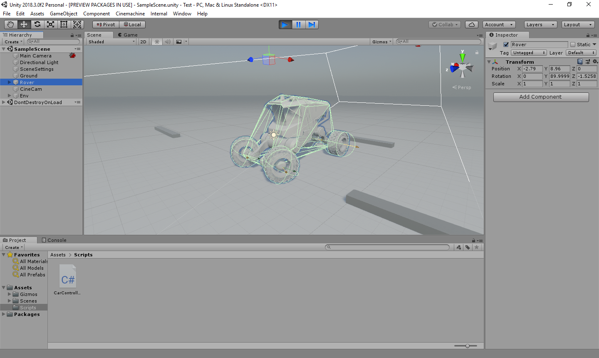
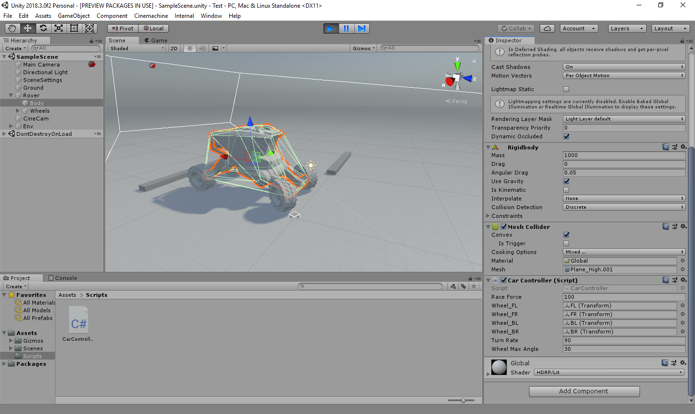

# UnityCarController
A physics based and open source implementation of Car controller using joints.

<b>  Why support unrealistic physics when Unity and Nvidia have blessings on us :D</b>
  

 
 
 
 
 

<b>Steps to use plugin</b> 
<ol>
  <li>Download the CarController script in your Assets</li>
  <li>Follow the steps in </li>
</ol>

<b><i>And ofcourse, if you dont have separate meshes for wheels and everything is in a single mesh, you could just make empty game objects, add the colliders and orient them properly instead of going back to 3D modelling software and breaking the mesh.</i></b>
